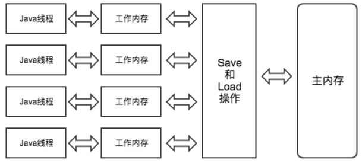
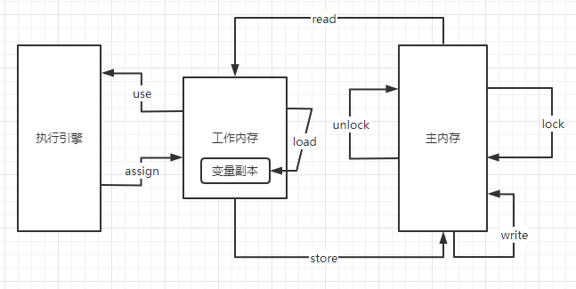
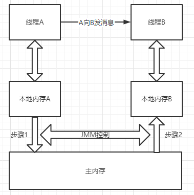
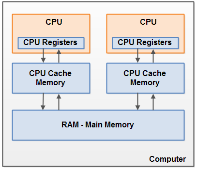
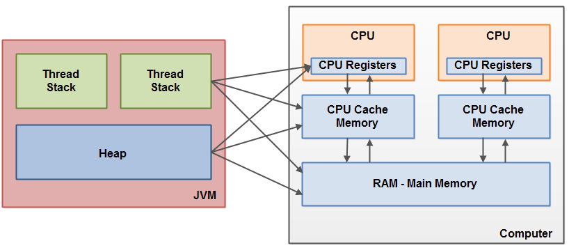
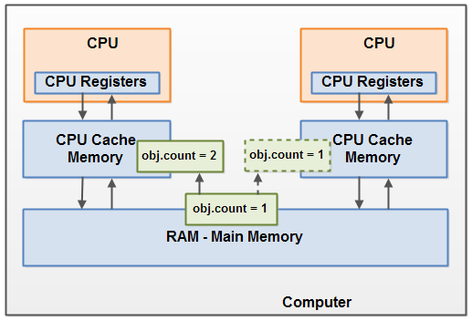
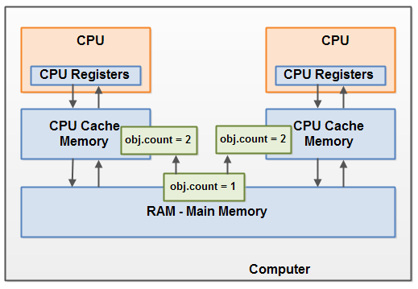

### Java内存模型

1. #### 概念

   1. *Java虚拟机*规范中试图定义一种Java内存模型**（Java Memory Model，<u>JMM</u>）**来*屏蔽掉各种硬件和操作系统的内存访问差异*，以实现让Java程序在*各种平台下*都能达到一致的内存访问效果。
   2. 区分于Java内存区域，内存区域指JVM运行时将数据分区域存储，强调划分内存空间，而内存模型定义了JVM在计算机内存(RAM)的工作方式

2. #### 定义的规范目标

   1. 规范各个**变量**的访问规则，即在虚拟机将变量*储存到内存*和从*内存中取出*变量的细节
   2. 这里定义的变量包括实例字段，静态变量，和构成数组对象的元素，不包括局部变量和方法参数，因为这两者是线程私有的，不会共享，也即不存在竞争
   3. 主要面向两个问题：<u>线程之间如何通信</u>？<u>线程之间如何同步</u>？

3. #### 主内存(Main Memory)和工作内存(Working Memory)

   1. 内存模型规定了，<u>*所有的变量都储存在主内存*</u>中，每条线程有自己的工作内存

   2. 线程的工作内存中保存了被该线程使用到的变量的主内存*副本拷贝*，线程对变量的所有*操作*（读取、赋值等）都*必须在工作内存中进行*，不能直接读写主内存中的变量。

   3. 此外，不同线程之间无法直接访问对方的工作内存的变量，线程之间的变量传递均需通过主内存完成[读写共享变量——*隐式通信*]

   4. 他们之间的关系图：

      

4. #### 内存之间的交互动作

   | 动作   | 作用                                                         |
   | ------ | ------------------------------------------------------------ |
   | lock   | 作用于*主内存变量*，把一个变量标记为一条线程独占的状态       |
   | unlock | 作用于*主内存变量*，把一个处于锁定状态的变量释放出来，释放后的变量猜可以被其他线程锁定 |
   | read   | 作用于主内存变量，把一个变量的值从主内存传输到线程的工作内存中，以便随后的load调用 |
   | load   | 作用于工作内存变量，把read操作从主内存中得到的变量放入工作内存的变量副本中 |
   | use    | 作用于工作内存变量，把工作内存中的一个变量的值传递给执行引擎，每当jvm遇到一个需要使用变量的值的字节码指令时将会执行该操作 |
   | assign | 作用于工作内存变量，把一个从执行引擎接收到的值赋给工作内存中的变量，每当虚拟机遇到一个给变量赋值的字节码指令时执行该操作 |
   | store  | 作用于工作内存变量，把工作内存中的一个变量的值传送到主内存中，以便随后的write调用 |
   | write  | 作用于*主内存变量*，把store操作从工作内存中得到的变量的值写入主内存的变量中 |

5. #### 流程图

     

6. #### 线程经典操作：

   1. 线程从主内存读取变量到工作内存然后执行引擎执行：<u>read->load->use</u>
   2. 线程从自己的执行引擎写到工作内存，最后写回主内存：<u>assign->store->write</u>

7. #### 线程之间的通信步骤

   1. 线程A将本地内存A中更新过的共享变量刷新到主内存中
   2. 线程B到主内存去读取线程A之间已经更新过的变量

   

8. #### 其他规定

     1. 如果要把一个变量从主内存中复制到工作内存，就需要按顺序地执行read和load操作， 如果把变量从工作内存中同步回主内存中，就要按顺序地执行store和write操作。
     2. 不允许read和load、store和write操作之一单独出现
     3. 不允许一个线程丢弃它的最近assign的操作，即*变量在工作内存中改变了之后必须同步到主内存中*。
     4. 不允许一个线程无原因地（没有发生过任何assign操作）把数据从工作内存同步回主内存中。
     5. 一个新的变量只能在主内存中诞生，不允许在工作内存中直接使用一个未被初始化（load或assign）的变量。即*就是对一个变量实施use和store操作之前，必须先执行过了assign和load操作*。
     6. 一个变量在*同一时刻只允许一条线程对其进行lock操作*，但lock操作可以被同一条线程重复执行多次，多次执行lock后，只有执行相同次数的unlock操作，变量才会被解锁。*lock和unlock必须成对出现*
     7. 如果对一个变量执行lock操作，将会<u>清空工作内存中此变量的值</u>，在执行引擎使用这个变量前需要重新执行load或assign操作初始化变量的值
     8. 如果一个变量事先没有被lock操作锁定，则不允许对它执行unlock操作；也不允许去unlock一个被其他线程锁定的变量。
     9. 对一个变量执行unlock操作之前，必须先把此变量同步到主内存中（执行store和write操作）。

9. #### 硬件层面

     1. 目前计算机内存架构

          

     2. CPU寄存器->CPU缓存->主内存

     3. 缓存

          1. **cpu缓存**：一般在 cpu 集成了多级缓存的结构，常见的为三级缓存的结构。

               L1 cache：分为数据缓存和指令缓存，逻辑核独占 

               L2 cache：物理核独占，逻辑核共享 

               L3 cache：所有物理核共享 

               空间大小排序：L3 > L2 > L1

               速度快慢排序：L3 < L2 < L1

          2. **缓存行**（cache line）：一般大小为 64byte，缓存由若干个缓存行组成。通常，CPU 在操作数据的时候都是以缓存行为最小单位对缓存进行数据操作

               查看缓存行大小：

               ```cmd
               [root@centos ~]# cat /sys/devices/system/cpu/cpu0/cache/index0/coherency_line_size
               ```

          3. 缓存行的结构：|valid|tag|data|

               + valid：标志该缓存行是否有效
               + tag：数据的内存地址
               + data：存放实际的数据

     4. 当一个CPU需要访问主存时，会先读取一部分主存数据到CPU缓存，进而在读取CPU缓存到寄存器。当CPU需要写数据到主存时，同样会先flush寄存器到CPU缓存，然后再在某些节点把缓存数据flush到主存。

10. #### java内存模型与硬件架构之间的桥接

      1. 他们之间的模型并不一致，实际上大部分的数据会存储到主存，但是有些栈堆的数据也可能存储到CPU寄存器中

      2. 这两者之间为<u>交叉关系</u>，如图所示

           

      3. 当对象和变量存储到计算机的各个内存区域时，必然会引发一些**问题**：

           1. *共享对象对各个线程的可见性*
           2. *共享对象的竞争现象*

11. #### JMM的一些问题

        1. ***缓存一致性***
             1. 当多个处理器都涉及同一块主内存区域时，可能会导致各自的缓存数据不一致的情况，多线程下尤甚，那么同步回主内存时又该以谁为准呢？
             2. 这个问题的解决方案是通过协议来规范行为来解决的，访问内存以及读写都要遵守协议，常见的有CPU的MESI协议

        2. ***指令重排序***
             1. 为了提高处理器的性能，会对输入代码进行乱序执行，处理器在计算之后会把乱序执行的结果重组，保证该结果与顺序执行的结果是一致的，但是并不保证程序中各个语句计算的先后顺序与输入代码中的顺序一致
             2. 如果存在一个计算任务依赖另一个计算任务的中间结果，那么其顺序性并不能靠代码的先后顺序来保证，跟处理器的乱序执行类似，JVM的即时编译器中也有类似的指令重排序优化
             3. 重排序有三种
                1. 编译器优化的重排序 -> 编译器在<u>不改变单线程程序语义</u>的前提下，可以重新安排语句的执行顺序；
                2. 指令级并行的重排序 -> 将多条指令重叠执行，如果不存在*数据依赖性*，处理器可以改变语句对应机器指令的执行顺序
                3. 内存系统的重排序 -> 处理器使用了<u>缓存和读/写缓存区</u>，会使得加载和存储操作看上去是乱序执行

12. #### JMM解决的问题

    1. ***共享对象对各个线程的可见性***

         1. 左边CPU中运行的线程从主存中拷贝共享对象obj到它的CPU缓存，把对象obj的count变量改为2。但这个变更对运行在右边CPU中的线程不可见，因为这个更改还没有flush到主存中
    
         2. 
    
         3. 以上属于线程缓存导致的可见性问题，解决该问题可以使用三种方法
            - *volatile关键字*
              - 该关键字可以保证*直接从主存读取一个变量，如果变量被修改，总是会被写回到主内存中*
              - 普通变量与volatile都是依赖主内存来实现可见性
              - 但是volatile可以强制*让线程在使用时都立即从主内存刷新，新值可以立即同步到主内存*
              - 这个特性可以保证多线程操作时变量的可见性
            - *synchronized关键字*
              - 同步块，独占锁
              - 如果对一个变量执行lock操作，将会清空工作内存中此变量的值，在执行引擎使用这个变量前需要重新执行load或assign操作初始化变量的值
              - 对一个变量执行unlock操作之前，必须先把此变量同步回主内存中（执行store和write操作)
            - *final关键字*
              - 被final修饰的字段在构造器中一旦被初始化完成，并且构造器没有把'this'的引用传递出去，那么在其他线程都能看见final字段值
              - 这里有"this"引用传递问题，this引用逃逸很危险，其他线程可能通过这个引用访问到"初始化了一半"的对象
            
         4. <u>重排序导致的可见性问题</u>
    
            1. ```java
               public static void main(String[] args) {
                  	Thread a -> Test t = new Test();
                   Thread b -> t.getName();
                   //由于new Test的过程可能会发生指令重排序
                   //正常顺序为1.申请空间 2.把new Test写入该空间 3.把空间地址赋值给引用t
                   //如果是线程a去getName()那完全没有问题，因为他的行为一定发生在这三个步骤之后
                   //如果是b去getName()，如果在new Test写入之前就去getName()，就会产生可见性的问题
               }
               ```
    
            2. 解决方案
    
               1. volatile，这个关键字本身就有*禁止重排序*的语义，应该是用内存屏障实现的吧
    
               2. synchronized[跟缓存一致性一样的原理]，不过他是用来保障线程之间操作的有序性
    
                  ```java
                  public class Singleton {
                      // 双重检查锁构造单例
                      // 同1的问题，两个线程如果执行到2进行重排序了，另一个线程到1的时候发现不为空，返回了一个还没写入空间的单例，就会有问题
                      private static volatile Singleton singleton;
                      private Singleton(){}
                      public static Singleton getInstance() {
                          if (singleton == null) { // 1
                              synchronized (Singleton.class) {
                                  if (singleton == null) {
                                      singleton = new Singleton(); // 2
                                  }
                              }
                          }
                          return singleton;
                      }
                  }
                  ```
    
    2. ***共享对象的竞争现象***
    
         1. <u>多个线程共享一个变量，如果同时修改，就产生竞争现象</u>
    
         2. 线程A和线程B共享一个对象obj。假设线程A从主存读取Obj.count变量到自己的CPU缓存，同时，线程B也读取了Obj.count变量到它的CPU缓存，并且这两个线程都对Obj.count做了加1操作。此时，Obj.count加1操作被执行了两次，不过都在不同的CPU缓存中。
    
              如果这两个加1操作是<u>串行执行</u>的，那么Obj.count变量便会在原始值上加2，最终主存中的Obj.count的值会是3。然而下图中两个加1操作是并行的，不管是线程A还是线程B先flush计算结果到主存，最终主存中的Obj.count只会增加1次变成2，尽管一共有两次加1操作。
    
         3. 
    
12. #### 数据依赖性

    如果两个操作访问同一变量，一个写一个读，此时这两个操作存在数据依赖性，这个时候不会重排序

14. #### as-if-serial语义

      不管怎么重排序，单线程程序的执行结果不能被改变

15. #### happen-before

      1. JDK1.5之后JMM使用happen-before的概念<u>阐述操作之间的内存可见性</u>，保证只要线程AB之间满足happen-before关系，执行操作B的线程可以看到操作A的结果，本质上就是JMM使用*内存屏障*来禁止指令重排序
      2. *程序顺序规则*：线程里的每一个操作，都先行与后来的线程里的每一个操作
      3. *监视器锁规则*：一个监视器锁的释放先行与每个相同监视器锁的加锁操作
      4. *volatile规则*：对volatile域变量的写操作先行与每一个后来的对该变量的读操作
      5. 线程启动规则：线程的start方法先行与线程对象里的每一个操作，比如run()
      6. 线程终止规则：线程里的每一个操作先行于其他线程检测到该线程已结束，或者该线程成功的从join()方法返回，或者从alive()返回false
      7. 线程中断规则：一个线程调用另一个线程的中断方法先行于被中断线程检测到中断
      8. 终接器规则：对象的构造函数必须在启动该对象的总结器之前执行完成
      9. *传递性*：如果A先行于B，B又先行于C，那么A先行于C

16. #### 内存屏障禁止特定类型的处理器重排序

      JMM重排序规则要求Java编译器在生成指令序列时，插入特定类型的内存屏障指令，通过它来禁止特定的处理器进行指令重排序，提供一致的内存可见性

      这里的内存屏障做的事情主要是强制刷CPU的cache，比如Write-Barrier会刷出所有在Barrier之前写入cache的数据，所以任何CPU都能读取到这些数据的最新版本

17. #### 原子性保证多线程写的同步问题

      1. 原子性：指一个操作是按原子的方式执行的，要么该操作不被执行，要么*执行过程不会被其他线程中断*，也即原子性

      2. 如何实现

           1. **使用java内存模型**

                可以认为，基本数据类型变量，引用类型变量，声明为volatile的任何类型变量的访问读写是具备原子性的，不过i++不具备，本身就不是，volatile也不能保证线程安全

           2. **同步块技术**->synchronized->java内存模型提供了lock和unlock，虚拟机提供了字节码指令monitorenter和monitorexist来隐式地执行操作


