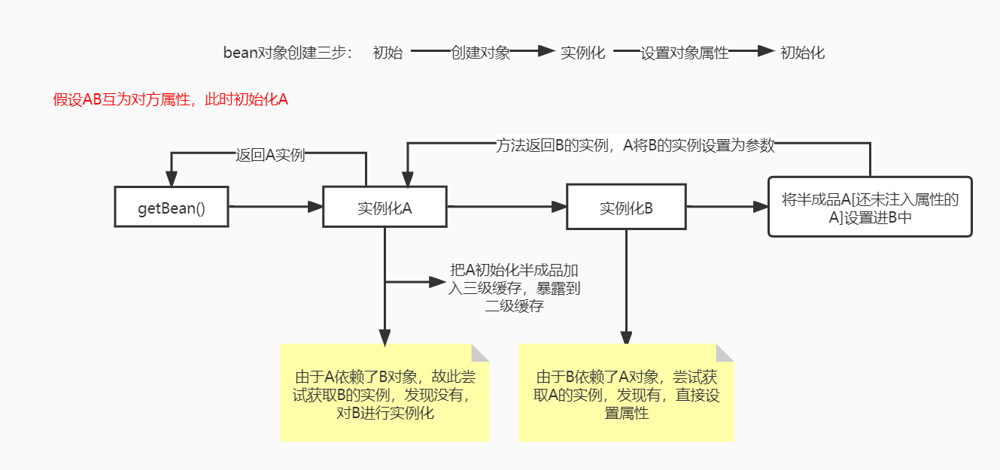

## Spring如何解决循环依赖？

```java
@component
class A {
    private B b;
}
@component
class B {
    private A a;
}
```

### 类A依赖了B作为属性，类B又使用类A作为属性，彼此循环依赖。



### 源码理解：

```java
//调用AbstractBeanFactory.doGetBean()，向IOC容器获取Bean，触发依赖注入的方法
protected <T> T doGetBean(
			String name, @Nullable Class<T> requiredType, @Nullable Object[] args, boolean typeCheckOnly)
			throws BeansException {
		...
         // 第一次getSingleton获取对象实例
		// 先从缓存中取是否已经有被创建过的单例类型的Bean[没有的话就去获取半成品的，也就是earlySingletonObjects，缓存二的东西]
		// 对于单例模式的Bean整个IOC容器中只创建一次，不需要重复创建
		Object sharedInstance = getSingleton(beanName);
    	...
        try {
            //创建单例模式Bean的实例对象
            if (mbd.isSingleton()) {
                //第二次getSingleton尝试创建目标对象，并且注入属性
                //这里使用了一个匿名内部类，创建Bean实例对象，并且注册给所依赖的对象
                sharedInstance = getSingleton(beanName, () -> {
                    try {
                        //创建一个指定Bean实例对象，如果有父级继承，则合并子类和父类的定义
                        return createBean(beanName, mbd, args);
                    } catch (BeansException ex) {
                        //显式地从容器单例模式Bean缓存中清除实例对象
                        destroySingleton(beanName);
                        throw ex;
                    }
                });
                // 如果传入的是factoryBean，则会调用其getObject方法，得到目标对象
                bean = getObjectForBeanInstance(sharedInstance, name, beanName, mbd);
                //IOC容器创建原型模式Bean实例对象
            }
            ...
        } catch (BeansException ex) {
            cleanupAfterBeanCreationFailure(beanName);
            throw ex;
        }
	    ...
	    return (T) bean;
	}
```

也就是实例化A的时候在缓存中没找到*[第一个getSingleton]*，就去第二个**getSingleton**实例化A*[实际上是调用了doCreateBean()]*，由于A需要B，又去**doGetBean**尝试获取B，发现B也不在缓存中，继续调用第二个**getSingleton**去实例化，当要注入属性A的时候在二级缓存找到了半成品A，成功注入返回到A实例化的阶段，将B注入。

#### 第一个getSingleton代码

```java
	@Nullable
	protected Object getSingleton(String beanName, boolean allowEarlyReference) {
		//从spring容器中获取bean
		Object singletonObject = this.singletonObjects.get(beanName);//缓存1
		//如果获取不到 判断要获取的对象是不是正在创建过程中----如果是，则去缓存(三级缓存)中取对象(不是bean)
		//isSingletonCurrentlyInCreation() 存放的对象 的时机是在getBean中第二次调用getSingleton时候beforeSingletonCreation(beanName);存进去的
		if (singletonObject == null && isSingletonCurrentlyInCreation(beanName)) {
			synchronized (this.singletonObjects) {
				singletonObject = this.earlySingletonObjects.get(beanName);//缓存2
				if (singletonObject == null && allowEarlyReference) {//allowEarlyReference--判断是否支持循环依赖，默认为true
					ObjectFactory<?> singletonFactory = this.singletonFactories.get(beanName);//缓存3
					if (singletonFactory != null) {
						singletonObject = singletonFactory.getObject();
						//将三级缓存升级为二级缓存
						this.earlySingletonObjects.put(beanName, singletonObject);
						//从三级缓存中删除  为什么删除?防止重复创建。设置三级缓存的目的是为了提高性能，因为每次创建都需要经过factory，会花费很多时间
						this.singletonFactories.remove(beanName);
					}
				}
			}
		}
		return singletonObject;
	}
```

在实例化AB的时候，三个缓存都是找不到这两个类的，因为两者均未创建；

#### 三级缓存

```java
	/** Cache of singleton objects: bean name --> bean instance */
	private final Map<String, Object> singletonObjects = new ConcurrentHashMap<>(256);//一级缓存，存放完整的bean信息

	/** Cache of singleton factories: bean name --> ObjectFactory */
	private final Map<String, ObjectFactory<?>> singletonFactories = new HashMap<>(16);//三级缓存，bean创建完了就放进去，还有他的bean工厂

	/** Cache of early singleton objects: bean name --> bean instance */
	private final Map<String, Object> earlySingletonObjects = new HashMap<>(16);//二级缓存，存放还没进行属性赋值的bean对象，也即半成品bean
```

#### 第二个getSingleton代码

此处将A先创建好<u>放入三级缓存</u>中，实际上是委托给另一个**doGetBean()**完成的

```java
public Object getSingleton(String beanName, ObjectFactory<?> singletonFactory) {
    	...
		synchronized (this.singletonObjects) {
			// 再次判断ioc容器中有无该bean
			Object singletonObject = this.singletonObjects.get(beanName);
			if (singletonObject == null) {
				..before..
				try {
					// 回调到doCreateBean
					singletonObject = singletonFactory.getObject();
					newSingleton = true;
				}
				..after..
			}
			return singletonObject;
		}
	}
```

由于第一个获取单例的方法找不到AB，故此将会进入第二个获取单例的方法试图找到，这个方法里**singletonFactory.getObject()**为核心，将会回调到**doCreateBean**方法继续创建Bean。

#### doCreateBean代码

```java
protected Object doCreateBean(String beanName, RootBeanDefinition mbd, @Nullable Object[] args)
			throws BeanCreationException {

		//封装被创建的Bean对象
		BeanWrapper instanceWrapper = null;
		if (mbd.isSingleton()) {
			//单例的情况下尝试从factoryBeanInstanceCache获取 instanceWrapper,并清除同名缓存
			instanceWrapper = this.factoryBeanInstanceCache.remove(beanName);
		}
		if (instanceWrapper == null) {
			// 创建Bean实例
			// instanceWrapper会包装好目标对象
			instanceWrapper = createBeanInstance(beanName, mbd, args);
		}
		...
		//向容器中缓存单例模式的Bean对象，以防循环引用，allowCircularReferences是判断是否支持循环依赖，这个值可以改为false
		boolean earlySingletonExposure = (mbd.isSingleton() && this.allowCircularReferences &&
				isSingletonCurrentlyInCreation(beanName));
		//判断是否允许循环依赖
		if (earlySingletonExposure) {
			...
			//将这个对象的工厂放入缓存中  （注册bean工厂singletonFactories，第一个getSingleton使用的），此时这个bean还没做属性注入
			//这里是一个匿名内部类，为了防止循环引用，尽早持有对象的引用
			// getEarlyBeanReference很特别，这里面会做aop代理
			addSingletonFactory(beanName, () -> getEarlyBeanReference(beanName, mbd, bean));
		}
		//Bean对象的初始化，依赖注入在此触发
		//这个exposedObject在初始化完成之后返回作为依赖注入完成后的Bean
		Object exposedObject = bean;
		try {
			//填充属性 -- 自动注入
			//前面是实例化，并没有设置值，这里是设置值.将Bean实例对象封装，并且Bean定义中配置的属性值赋值给实例对象
           	 //这里做注入的时候会判断依赖的属性在不在，不在就调用doGetBean继续创建
			populateBean(beanName, mbd, instanceWrapper);
			// 该方法主要是对bean做一些扩展
			// 初始化Bean对象。属性注入已完成，处理各种回调
			// （对实现Aware接口(BeanNameAware、BeanClassLoaderAware、BeanFactoryAware)的bean执行回调、
			// aop、init-method、destroy-method?、InitializingBean、DisposableBean等）
			exposedObject = initializeBean(beanName, exposedObject, mbd);
		}
		...
		return exposedObject;
	}
```

在这个方法里，实例化A的时候，已经把A作为一个半成品通过调用*addSingletonFactory*方法将其加入了三级缓存singletonFactories，方便在递归实例化B的时候可以获取到A的半成品实例，详细代码如下：

#### 将创建的bean加入<u>三级缓存</u>

发生在**addSingletonFactory**这个方法

```java
protected void addSingletonFactory(String beanName, ObjectFactory<?> singletonFactory) {
		Assert.notNull(singletonFactory, "Singleton factory must not be null");
		synchronized (this.singletonObjects) {
			if (!this.singletonObjects.containsKey(beanName)) {
				//放到三级缓存
				// 注册bean工厂
				this.singletonFactories.put(beanName, singletonFactory);
				this.earlySingletonObjects.remove(beanName);
				this.registeredSingletons.add(beanName);
			}
		}
	}
```

那么是在什么时候会发生一个递归的调用呢？

实际上是在<u>populateBean(beanName, mbd, instanceWrapper);</u>要做属性注入的时候，假设是根据名称自动注入的，调用<u>autowireByName(),</u>该法会去循环遍历在getBean之前已经把xml文件的属性加入到注册表之类的属性，

populateBean有一个autowireByName的方法，代码如下

```java
protected void autowireByName(
			String beanName, AbstractBeanDefinition mbd, BeanWrapper bw, MutablePropertyValues pvs) {

		//对Bean对象中非简单属性(不是简单继承的对象，如8中原始类型，字符串，URL等都是简单属性)进行处理
		String[] propertyNames = unsatisfiedNonSimpleProperties(mbd, bw);
		for (String propertyName : propertyNames) {
			//如果Spring IOC容器中包含指定名称的Bean，就算还没进行初始化，A发现有B属性时，B属性已经被写入注册表之类的东西，所以这个判断返回true
			if (containsBean(propertyName)) {
				//调用getBean方法向IOC容器索取指定名称的Bean实例，迭代触发属性的初始化和依赖注入
				Object bean = getBean(propertyName); //实际上就是委托doGetBean()
				pvs.add(propertyName, bean);
				//指定名称属性注册依赖Bean名称，进行属性依赖注入
				registerDependentBean(propertyName, beanName);
				if (logger.isDebugEnabled()) {
					logger.debug("Added autowiring by name from bean name '" + beanName +
							"' via property '" + propertyName + "' to bean named '" + propertyName + "'");
				}
			}
			...
		}
	}
```

*Object bean = getBean(propertyName);* 这个方法实际上又去委托了doGetBean()，又一次递归的走上了流程，也就是A在实例化到该步时发现，还有一个B，就会又从doGetBean()开始，一步步的寻找创建，不同的是，当B走到这个根据名称注入的方法时，此时的已经能在二级缓存里找到A的身影了，无需再次创建A对象。

### 总结

spring运用三级缓存解决了循环依赖的问题；

采用递归的方式，逐步的去实例化对象，并将上一步已经加入缓存的半成品对象作为属性注入；

等到走到最后一个递归时，将会逐步返回，把对应的实例一个个创建好。