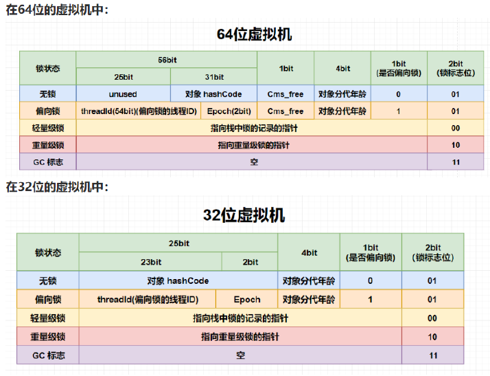
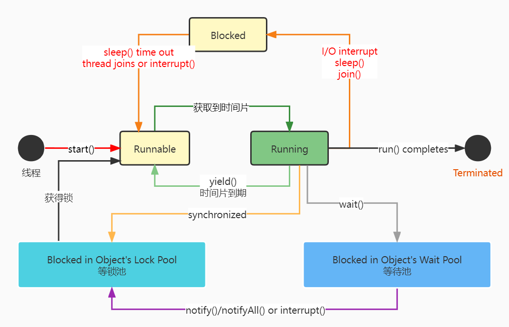

### 线程面试题

1. #### 什么是进程？什么是线程？为什么需要多线程？多线程一定好吗？

    1. ##### 什么是进程？

        1. 进程被定义为具有一定独立功能的程序关于某个数据集合上的一次运行活动，是操作系统进行资源分配和调度的一个独立单位；
        2. 简单来说，程序是一堆代码，那么进程就是执行代码的过程。

    2. ##### 什么是线程？

        1. 线程是进程的下属单位，是CPU调度和分派的基本单位；
        2. 进程通常是独立内存的，一个应用程序一般也是单进程，而线程是共享内存的；

    3. ##### 为什么需要多线程？

        多线程的服务能带来更好的性能，两只手做事总比一只手快

    4. ##### 多线程一定好吗？

        1. 不一定，一个进程里的多线程会对其他进程的资源造成影响，因为他<u>占用了更多的CPU</u>
        2. 多线程之间靠CPU进行**上下文切换**，调度会浪费时间和资源

2. #### 什么是线程安全？

    1. <u>如果一段代码在单线程环境和多线程环境下执行的结果永远一致，则线程安全</u>
    2. 换言之，什么是线程不安全，如果多线程环境下，单个变量会被多个线程同时修改，造成数据污染
    3. 线程安全还有几个级别
        1. 不可变：像Integer，Long这种final修饰的类，任何线程都不能改变它的值
        2. 绝对线程安全：不管运行环境如何，调度者都不用做什么额外操作，像CopyOnWriteArrayList
        3. 相对线程安全：这个是传统意义上的线程安全，像Vector的add，remove方法都是原子操作，不会被打断，不过也有问题，如果线程在add这个Vector，另一个线程在遍历这个Vector，那么极大概率会发生ConcurrentModificationException，就是<u>fail-fast</u>机制
        4. 线程非安全：像ArrayList，HashMap都不安全

3. #### 实现多线程的程序方式？

    1. 继承Thread：这个方式有点不好，因为JAVA是单继承的，如果一个类继承了Thread之后就不能继承别的了，不够灵活
    2. 实现Runnable接口：同方式一，可以**重写run()方法**来定义线程的行为
    3. JAVA5之后的，实现Callable接口，这个接口的call()方法可以在线程执行结束之后产生一个返回值

4. #### synchronized关键字的用法？

    这个关键字在于将对象和方法标记为同步，才能实现对象和方法的互斥访问，也即加上一个**同步锁**，如果有两个线程同时访问一个被修饰的方法，那么其中有一个线程会被阻塞，直到上一个线程执行完毕；

    ```java
    synchronized(对象){
    
    ...
    
    }
    ```

    或者把<u>synchronized作为方法的修饰符</u>

5. #### java.util.concurrent.locks.Lock与synchronized

    Lock是JAVA5之后引进的，可以实现synchronized所有的功能

    不同在于，Lock不需要一定要获得锁，但是需要*手动释放锁*，最好在*finally块*中释放，<u>synchronized会自动释放锁</u>

6. #### 当一个线程进入一个对象的synchronized方法A之后，其它线程是否可进入此对象的synchronized方法B？

    不能。其它线程只能访问该对象的非同步方法，同步方法则不能进入。

    因为非静态方法上的synchronized修饰符要求执行方法时要**获得对象的锁**，如果已经进入A方法说明**对象锁已经被取走**，那么试图进入B方法的线程就只能在*等锁池*中等待对象的锁。

7. #### synchronized和ReentrantLock的区别

    本质上：一个是关键字一个是类

    ReentrantLock作为一个类，可以提供比关键字更灵活的功能特性，例如

    1. ReentrantLock可以对获取锁的**等待时间**进行设置，这样就*避免了死锁*
    2. ReentrantLock可以获取各种锁的信息
    3. ReentrantLock可以灵活地实现多路通知[使用Condition--对象监视器来进行多路通知，我还不会用😓]

    机制上：ReentrantLock使用Unsafe的park方法，synchronized可能是操作对象头的**Mark Word**，里面有锁标志位等等，比较复杂

    

8. #### 举例说明同步和异步

    1. 同步：就是**阻塞式**操作，如果系统存在临界资源，也即资源数量少于竞争资源的线程的数量的资源，这些数据可能会被污染，比如正在读的数据已经被另一个线程写过了，这个就需要同步读取，比如数据库的独占锁
    2. 异步：就是**非阻塞**，一段代码执行时间太漫长了，而且也不需要这段代码的返回值做后续操作，就可以通过异步编程，更有效率

9. #### 启动一个线程是run()还是start()方法？

    启动一个线程是调用start()方法，使线程所代表的虚拟处理机处于可运行状态，这意味着它可以由JVM 调度并执行，这并**不意味着线程就会立即运行**。

    当可运行状态的线程获得CPU之后，JVM就可以调用run方法了，run()方法是线程启动后要进行回调（callback）的方法。

10. #### 为什么需要run()和start()方法，可以只用run()来完成吗？

    我们需要这两个方法是因为JVM创建一个单独的线程不同于普通方法的调用，所以这项工作由线程的start方法来完成，start由本地方法实现，需要显示地被调用

    使用这两个方法的好处是任何一个对象都可以作为线程运行，只要实现了Runnable接口，这就避免因继承了Thread类而造成的Java的多继承问题。

11. #### 什么是线程池(Thread Pool)？

     1. 为什么需要池？在面向对象的编程中，创建和销毁对象不仅耗时且耗资源，JVM进行垃圾回收时就要跟踪每一个对象，那么<u>为了提高效率，就要尽可能的去减少创建和销毁对象</u>。这也是为什么产生了**池**的原因
     2. 线程池顾名思义就是事先创建若干个可执行的线程放入一个池（容器）中，需要的时候从池中获取线程不用自行创建，使用完毕不需要销毁线程而是放回池中，从而减少创建和销毁线程对象的开销。
     3. Java 5+中的Executor接口定义一个执行线程的工具，要自己定义一个比较麻烦，有现成的静态方法可以生成常用的线程池
         1. *newSingleThreadExecutor*：创建一个**单线程**的线程池。这个线程池只有一个线程在工作，也就是相当于单线程串行执行所有任务。如果这个唯一的线程因为异常结束，那么会有一个新的线程来替代它。此线程池保证所有任务的执行顺序按照任务的提交顺序执行。
         2. *newFixedThreadPool*：创建**固定大小**的线程池。每次提交一个任务就创建一个线程，直到线程达到线程池的最大大小。线程池的大小一旦达到最大值就会保持不变，如果某个线程因为执行异常而结束，那么线程池会补充一个新线程。
         3. *newCachedThreadPool*：创建一个**可缓存**的线程池。如果线程池的大小超过了处理任务所需要的线程，那么就会回收部分空闲（60秒不执行任务）的线程，当任务数增加时，此线程池又可以智能地添加新线程来处理任务。此线程池大小完全依赖于JVM能够创建的最大线程大小，无限制。
         4. *newScheduledThreadPool*：创建一个**大小无限**的线程池。此线程池支持定时以及周期性执行任务的需求。

12. #### 线程的基本状态以及状态之间的关系？

     

13. #### 产生死锁的条件

     1. *互斥条件*：一个资源只能被一个线程使用
     2. *请求与保持条件*：一个线程因请求资源阻塞时，对已有的资源保持不放
     3. *不剥夺条件*：线程已获得的资源，在未使用完之前，不能强行剥夺
     4. *循环等待条件*：若干线程之间形成一种头尾相衔接的循环等待资源的关系
    
14. #### 线程饿死？活锁？

     1. 线程一直请求不到资源，处于等待状态，一直谦让别的线程执行，这就是线程饿死
     2. 活锁有以下几种情况：
        1. 当所有线程都处于<u>无限循环状态</u>
        2. 当所有线程在程序中执行<u>Object.wait(0)</u>，即参数为0的wait方法，程序将发生**活锁**直到在相应的对象上有线程调用Object.notify()或notifyAll()；

15. #### 什么会导致线程阻塞？

     1. 定义：暂停一个线程的执行，以等待某一条件的发生，譬如请求到某资源；

     2. 方法：

        1. *sleep()*

           该方法允许指定的一段毫秒时间为单位作为参数，使得线程在指定时间内进入阻塞状态(*Blocked*)，无法得到CPU时间，时间一过，重新进入可执行状态(*Runnable*)

        2. *suspend()*

           使得线程进入阻塞状态，并不能自动恢复，调用其对应的resume()方法使其恢复，可以用于在等待另一线程的结果时，还未有结果进入阻塞，结果一出即可resume

        3. *yield()*

           使当前线程放弃已有的CPU时间，但不会进入Blocked状态，进入Runnable状态，随时可以再度获得CPU时间，调用该方法等价于调度程序认为该线程已经执行足够多的时间而转到另一线程

        4. *wait()*

           可以使线程进入Blocked状态，有两种形式，一种可以有指定毫秒时间为参数，另一种没有参数；

           前者当线程超出指定等待时间或者对应的notify()被调用时会进入Runnable状态，后者比如等对应的notify()被调用；

16. #### 怎么检测一个线程是否持有对象监视器？

     Thread提供了一个静态方法*holdsLock*(Object obj)，当且仅当对象obj的监视器被某条线程持有的时候返回true，这里的某条线程指的就是当前线程；

17. #### 线程同步以及线程调度的相关方法

     1. *wait()*

        使一个线程处于Blocked状态，并且释放所持有的对象的锁；

     2. *sleep()*

        使一个线程从运行状态处于睡眠状态，是一个静态方法，调用此方法要处理*InterruptedException*异常[如果该线程在sleep被其他线程中断，会抛出该异常]；

     3. *notify()*

        唤醒一个处于等待状态的线程，但是不能确切地唤醒某一个处于等待状态的线程，只能等JVM自己确定，且与优先级无关；

     4. *notifyAll()*

        唤醒所有处于等待状态的线程，该方法并不是将对象的锁给所有线程，而是让他们竞争，只有获得锁的线程才能进入就绪Runnable状态；

18. #### sleep()、join()、yield()的区别

     1. *优先级*：sleep给其他线程运行机会的时候是不会考虑优先级的，所以低优先级的线程也有机会被调到Runnable状态，但是yield只会给相同优先级乃至更高优先级的线程机会去运行；
     2. *状态*：sleep->blocked；yield->runnable
     3. *异常*：sleep->InterruptedException；yield什么异常都没有声明
     4. *移植性*：sleep比yield具有更好的移植性
     5. *锁标志*：sleep和yield都不会释放锁标志，也就是说如果持有synchronized同步块，别的线程还是不能访问的，wait会释放
     6. join方法会使当前线程等待调用join方法的线程执行完之后才能执行，就像被插队了一样，还不能干架

19. #### wait(),notify()和suspend(),resume()的区别

     1. <u>释放锁标志</u>：wait和notify，notifyAll都是JDK强制一定要先获得对象锁，调用的时候就算线程进入阻塞等待状态都不会释放锁标志，但是suspend和resume属于Thread类，所有的对象都可以拥有这一对方法
     2. <u>所处位置</u>：wait和notify都必须在synchronized同步块里使用，因其特性决定，要调用这一对方法的对象锁必须为当前线程所持有，这样才有锁可以释放，如果不满足这一条件，就算编译通过了，运行时也会出现IllegalMonitorStateException异常哒
     3. <u>选择性</u>：调用resume会释放该对象的锁[毕竟每个对象都有一个这个方法]，但是调用所有对象都有的notify方法的时候，就会导致调用该对象的wait方法而进入阻塞的线程随机选一条唤醒进入等锁池，得获得锁才能进入runnable的状态

     调用notify的时候会随机唤醒一条该对象wait方法进入阻塞的线程，然后拿到锁才能进入可执行状态，但是notifyAll呢就一次全唤醒，但是只有一个线程拿到锁才能进入可执行状态，这个时候竞争就比较激烈了

20. #### wait()方法和notify()/notifyAll()方法在放弃对象监视器时有什么区别

     1. 首先要知道什么是对象监视器，定义在何处，有什么作用？

         对象监视器实际上是每个对象关联的Monitor，也叫管理锁，实际上是一个数据结构，维护着一系列等待队列之类的东西

         上面的问题可以知道，这三个方法的调用前提都是必须拥有对象锁，也即对象的监视器，这三个方法必须注册在同一个对象监视器[同步监视器]上，否则就会抛出异常IllegalMonitorStateException

         这三个方法都定义在Object这个类中，在使用时必须是自己的锁对象来调用，锁是任意对象都有的东西，既然大家都有就得抽出来，放在Object这个超类中也就理所当然了

     2. 回到正题，放弃对象监视器上有什么区别？

         wait会立刻释放对象监视器，另外两个会等线程剩余代码执行完毕才会放弃

21. #### Runnable和Callable的区别

     1. runnable方法的<u>返回值是void</u>，他只会纯粹地去执行run()方法里面的内容而已
     2. callable会<u>有一个返回值</u>，是一个泛型，和Future、Future Taks配合就可以获取异步执行的结果[尚未尝试]
     3. callable的这个特性对多线程来说很有帮助，可以获得多线程运行的结果，或者是等待太久没获得结果的情况下取消该线程的任务

22. #### sleep()和wait()的区别

     1. sleep是Thread的静态方法，调用该方法可以让线程暂停执行指定的时间，进入阻塞状态，将执行的机会让与其他线程，但是他手上的锁是不会放出来的，直到等待时间一过，又可以进入可执行状态
     2. wait是Object的方法，调用他会让线程立刻让出锁，进入对象的等待池，只有调用notify或者notifyAll才能进入等锁池，直到获得锁才能进入可执行状态，具体详见线程状态切换图

23. #### 怎么唤醒一个阻塞的线程

     1. 如果是调用了wait，sleep或者join而导致的阻塞，就可以中断线程，并且通过抛出InterruptedException来唤醒他
     2. 如果是IO阻塞，那么就交给操作系统吧，JAVA也无可奈何

24. #### 什么是多线程的上下文切换

     就是先把前一个任务的 CPU <u>上下文（也就是 CPU 寄存器和程序计数器）</u>保存起来，然后加载新任务的上下文到这些寄存器和程序计数器，最后再跳转到程序计数器所指的新位置，运行新任务。

     CPU太快了，他可以一次运行多个任务，其实就是在更细微的时间单位下以超快的速度来回切换，才会让人们觉得他是一次执行多条任务，实际上也是一次一条

25. #### 一个线程出现运行时异常会怎样？

     如果异常没有被捕获，这个线程就暂停执行了

     **如果这个线程有某个对象的对象监视器，也会立刻释放的**

26. #### 如何在两个线程之间共享数据

     实际上从一开始我们就说了，线程之间是内存共享的，而进程不行[有的好像可以]

     只要在线程之间共享对象就好了，wait，notify，await，signal进行唤醒和等待，比方说<u>阻塞队列BlockingQueue就是为了线程之间数据共享设计</u>的

27. #### 如何正确使用wait，if还是while？

     wait方法应该在循环里面调用，因为当线程获取到CPU可以执行的时候，其余条件可能尚未满足，在处理前循环检测条件是否满足更为合适

     ```java
     synchronized(obj) {
         while(condition dose not hold) {
             obj.wait();
         }
     }
     ```

28. #### 什么是线程局部变量ThreadLocal？

     属于线程自享的，不在多个线程之间共享的变量，java提供这个类来支持线程安全。

     使用上要小心，比如web服务器，工作线程的生命周期比任何应用变量是要长上许多的，如果线程局部变量在工作完成之后没有被释放，java应用就存在**内存泄漏**的风险

29. #### ThreadLocal的作用？

     实际上就是**用空间来换时间**

     在每个Thread里面维护一个ThreadLocal，ThreadLocalMap把数据进行隔离，不共享，自然不会有线程安全的问题

30. #### ThreadLocal原理

     1. ThreadLocal是如何做到为每一个线程维护一份独立的变量副本的呢？在ThreadLocal类中有一个Map，<u>键为线程对象，值是其线程对应的变量的副本</u>，自己要模拟实现一个ThreadLocal类其实并不困难，代码如下所示：

     2. ```java
         import java.util.Collections;
         import java.util.HashMap;
         import java.util.Map;
         public class MyThreadLocal<T> {
             private Map<Thread, T> map = Collections.synchronizedMap(new HashMap<Thread, T>());
             //设置当前线程的线程局部变量的值
             public void set(T newValue) {
                 map.put(Thread.currentThread(), newValue);
             }
             //获取当前线程对应的线程局部变量的值
             public T get() {
                 return map.get(Thread.currentThread());
             }
             //删除当前线程对应的线程局部变量的值
             public void remove() {
                 map.remove(Thread.currentThread());
             }
         }
         ```

31. #### 如果提交任务的时候，线程池队列已经满了，会发生什么？

     1. 如果使用的是LinkedBlockingQueue无界队列，随便你加
     2. 如果是ArrayBlockingQueue，满了会执行**拒绝策略**<u>RejectedExecutionHandler</u>来处理，一般是<u>AbortPolicy</u>，即丢弃任务并且抛出RejectedExecutionException

32. #### java中用到的线程调度算法是什么？

     **抢占式**。一个线程用完CPU之后，操作系统会根据线程优先级，饥饿情况等数据算出一个总的优先级并且分配下一个时间片给某个线程执行

33. #### Thread.sleep(0)的作用？

     由于java是抢占式的线程调度，可能会出现一条线程一直能获取时间片的情况，为了让一些低优先权的线程也能获得CPU的控制权，就可以采用这个方法手动触发一次操作系统分配时间片的操作，也是平衡CPU的一种方法

34. #### CAS？

     1. compare and swap ->比较-替换
     2. 假设内存值V，旧的预期值A，要修改的值B，当且仅当V==A，才把内存值V修改为B并且返回true。
     3. 否则什么都不做然后返回false
     4. 这个操作需要volatile配合，才能保证拿到的变量是内存最新的值，不然旧的预期值A对某条线程来说就是一个不会变的值，没有什么用
     5. <u>CAS存在的三个问题</u>
         1. *ABA*：JDK1.5之后提供了解决方案，加了一个版本号，每次线程写操作时版本号+1，变化过程就是1A-2B-3A，不过ABA对基本数据类型没什么影响，引用类型可能存在影响
         2. *循环时间长，CPU开销大*
         3. *只能保证一个共享变量的原子操作*，JDK1.5之后提供了解决方案，提供了AtomicReferenc来保证引用对象之间的原子性，可以把多个变量放在一个对象里来CAS操作

35. #### 乐观锁和悲观锁

     1. 乐观认为竞争不总是会发生的，就不需要持有锁，把CAS作为一个原子操作尝试去修改内存值，如果失败表示有冲突，那么就要有相应的重试逻辑
     2. 悲观认为竞争一定存在，故每次操作都给你加把锁，就像synchronized，不管三七二十一，给你锁上了我再去做我的事情

36. #### ConcurrentHashMap的工作原理

     1. JDK1.7之前，采用segment分段锁
     2. JDK1.8之后，使用CAS+synchronized来实现同步问题，底层还是数组+链表->红黑树

37. #### CyclicBarrier和CountDownLatch区别

     1. 都可以表示代码运行到某个点上
     2. 区别：
         1. CyclieBarrier的某个线程运行到某个点上，该线程立即停止，直到所有线程都到了，全部开始运行；而CountDownLatch则是某线程到某个点上则给某个数值-1而已，该线程会继续运行
         2. CyclieBarrier只能唤起一个任务，CountDownLatch可以唤起多个[new 的时候传入一个数值，每次CountDown就-1，等到变成0就复活所有await线程]
         3. CyclieBarrier可重用，CountDownLatch不可重用，等他是0的时候就不能再用了

38. #### java中++符号是线程安全的吗

     粗浅回答，不安全，表面上涉及了至少三个操作，在机器语言方面就更不止，但就这三个操作也足以证明

     - 先读取变量值[获取i]

     - 增加[i自增]

     - 储存回内存[回写]

     这个过程很可能出现多个线程交叉

39. #### 现有三个线程T1,T2,T3，如何保证他们按顺序执行？

     可以使用join()方法，在一个线程中启动另一个线程，应当在T3中调用T2，T2中调用T1，这样能让T1先完成；

40. 


